# Architecture & Data Flow

Everything about how the IT Workflow Management System is put together: the
request lifecycle, the RBAC model, all five business rules traced end to end,
the data model, and the API contracts.

---

## Contents

1. [System shape](#1-system-shape)
2. [The request lifecycle](#2-the-request-lifecycle)
3. [Authentication & token flow](#3-authentication--token-flow)
4. [DB-driven RBAC](#4-db-driven-rbac)
5. [The data model](#5-the-data-model)
6. [Business rules, traced end to end](#6-business-rules-traced-end-to-end)
7. [Frontend architecture](#7-frontend-architecture)
8. [API reference](#8-api-reference)
9. [Error model](#9-error-model)
10. [Phase 2 — the project working area](#10-phase-2--the-project-working-area)
11. [What I would do next](#11-what-i-would-do-next)

---

## 1. System shape

Two independently deployable apps over one HTTP contract.

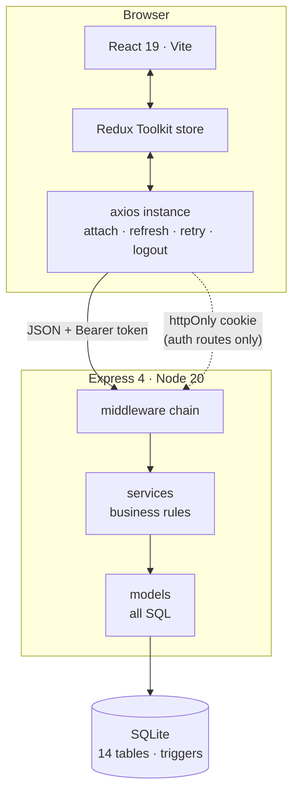

The layering rule is strict and worth stating, because it is what keeps the
business rules verifiable:

| Layer | May do | May **not** do |
| --- | --- | --- |
| `routes` | declare permissions, validate input, write audit rows | contain business logic |
| `services` | enforce rules, own transactions | write raw SQL |
| `models` | write SQL, cast row shapes | know about HTTP or `req` |

Because **all SQL is confined to `models/`**, a claim like *"only one code path
writes `stage.status`"* is checkable with a single `grep`, not an argument.

---

## 2. The request lifecycle

Every authenticated request passes through the same chain, in this order:

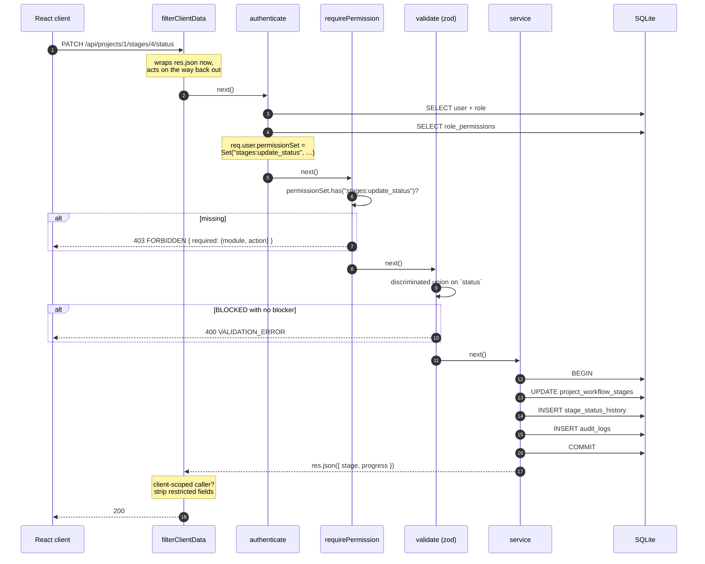

Three points about this ordering:

- **`filterClientData` is mounted before the routers** because it must replace
  `res.json` before any controller reaches for it. Its logic runs on the way
  *out*. Mounting it globally means no future route can forget Business Rule 4.
- **`authenticate` hits the database for permissions on every request.** That
  is a deliberate trade: one indexed join per request buys immediate revocation.
- **The service owns the transaction**, so the stage update, the history row and
  the audit row either all land or none do.

---

## 3. Authentication & token flow

Two tokens with different jobs and different threat models.

| | Access token | Refresh token |
| --- | --- | --- |
| Format | JWT (HS256) | 64 random bytes, opaque |
| Lifetime | 15 minutes | 7 days |
| Travels in | `Authorization: Bearer` | httpOnly cookie, `Path=/api/auth` |
| Stored client-side | **in memory only** | browser cookie jar, unreadable by JS |
| Stored server-side | not at all | SHA-256 hash only |
| Contains | `sub`, `email`, `roleId`, `roleKey` | nothing — it is a lookup key |

The access token deliberately does **not** carry the permission list. Baking
permissions into a 15-minute token means a revocation can take 15 minutes to
apply; reading `role_permissions` per request makes it immediate.

### Login and rotation

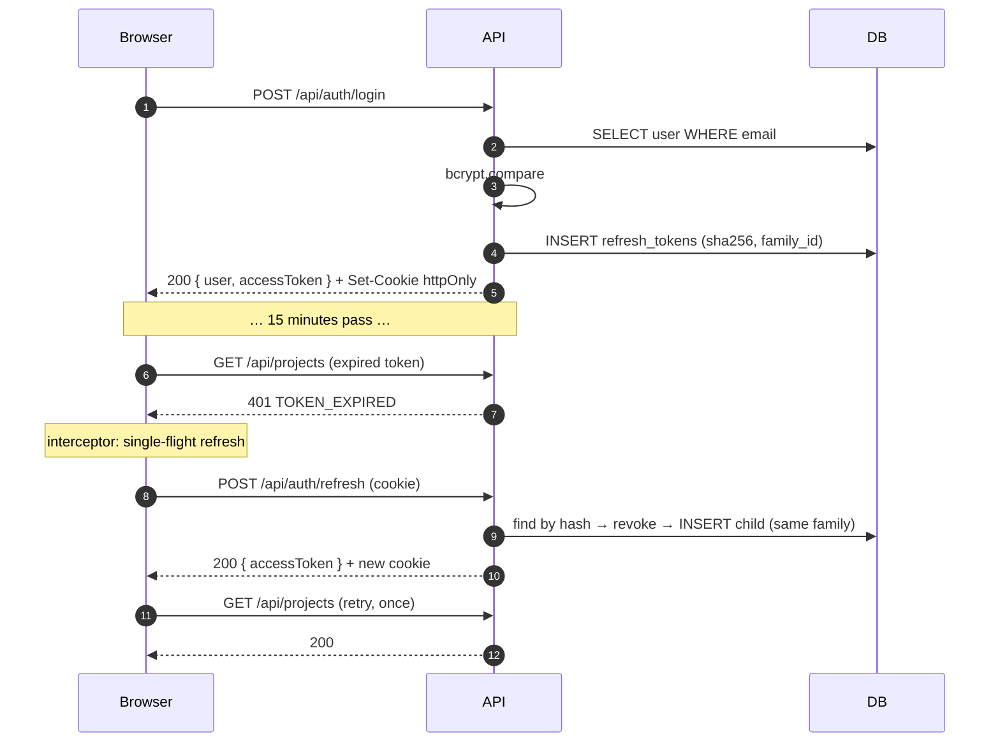

### Replay detection

Rotation makes a stolen cookie detectable. If a token that was already revoked
is presented, either the legitimate client or an attacker is replaying it — and
the server cannot tell which, so it revokes **the whole family** and forces a
fresh login.

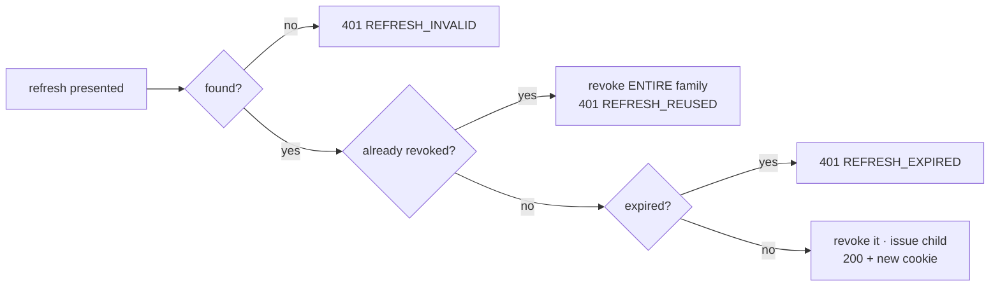

> **This is why the client's refresh is single-flight.** Five parallel requests
> that all 401 must produce **one** refresh, not five — otherwise four of them
> present a token the first already revoked, and the app logs the user out by
> its own hand. React StrictMode double-invokes effects in development, so the
> startup `bootstrapSession()` reproduced this on every page load until both it
> and the interceptor were routed through the same shared promise.

---

## 4. DB-driven RBAC

### The model

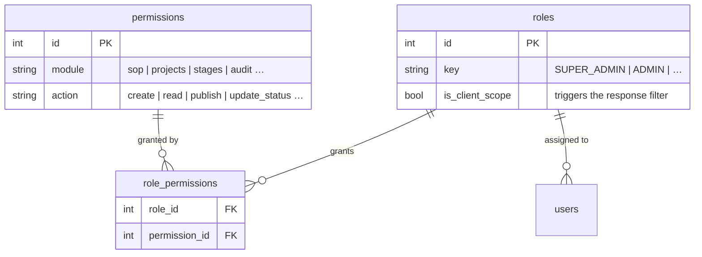

A permission is the tuple `module:action`. Authorisation asks exactly one
question, and it is a database question:

```js
// server/src/middleware/authorize.js — the entire decision
if (!req.user.permissionSet.has(`${module}:${action}`)) {
  return next(ApiError.forbidden(`Missing permission: ${module}:${action}`));
}
```

There is no role-name comparison in the request path. A test enforces this by
walking `server/src/`, stripping comments, and failing if any runtime file
matches `role === '…'` or `=== 'ADMIN'`:

```js
// server/tests/rbac.test.js
expect(offenders).toEqual([]);
```

Another test proves the consequence: an Admin is denied `POST /api/sop/:id/publish`,
a Super Admin inserts the permission row through `PUT /api/roles/:id/permissions`,
and **the very next request from the same session succeeds** — no redeploy, no
re-login.

### The seeded matrix

`server/src/db/permissions.catalog.js` is *seed data*. Nothing at request time
imports it.

| Module · action | Super Admin | Admin | IT Member | Client/Ops |
| --- | :-: | :-: | :-: | :-: |
| `users:read` / `create` / `update` | ✅ | ✅ | — | — |
| `users:deactivate` / `reassign` | ✅ | ✅ | — | — |
| `roles:read` / `update` | ✅ | read | — | — |
| `sop:read` | ✅ | ✅ | ✅ | — |
| `sop:create` / `update` / `reorder` / `delete` | ✅ | — | — | — |
| `sop:publish` | ✅ | — | — | — |
| `projects:read` | ✅ | ✅ | ✅ | ✅ |
| `projects:read_all` | ✅ | ✅ | — | — |
| `projects:create` / `update` / `assign` | ✅ | ✅ | — | — |
| `stages:read` | ✅ | ✅ | ✅ | ✅ |
| `stages:update_status` | ✅ | — | ✅ | — |
| `stages:assign` | ✅ | ✅ | — | — |
| `documents:read` | ✅ | ✅ | ✅ | — |
| `documents:create` | ✅ | — | ✅ | — |
| `audit:read` | ✅ | ✅ | — | — |

Read the Client column: it is Business Rule 4 expressed as data. The absence of
`audit:read` *is* the 403 on `/api/audit`.

### Row-level scoping

Permissions decide *what you may do*; scope decides *which rows you may do it to*.

```js
// server/src/middleware/authorize.js
export function resolveScope(user) {
  if (user.isClientScope) return { clientName: user.clientName };  // roles.is_client_scope
  if (can(user, 'projects', 'read_all')) return null;              // unrestricted
  return { memberOf: user.id };                                    // own assignments only
}
```

Both branches are data-driven — a column and a permission row, not a name. The
scope becomes a `WHERE` clause, so out-of-scope rows never enter the process.

---

## 5. The data model

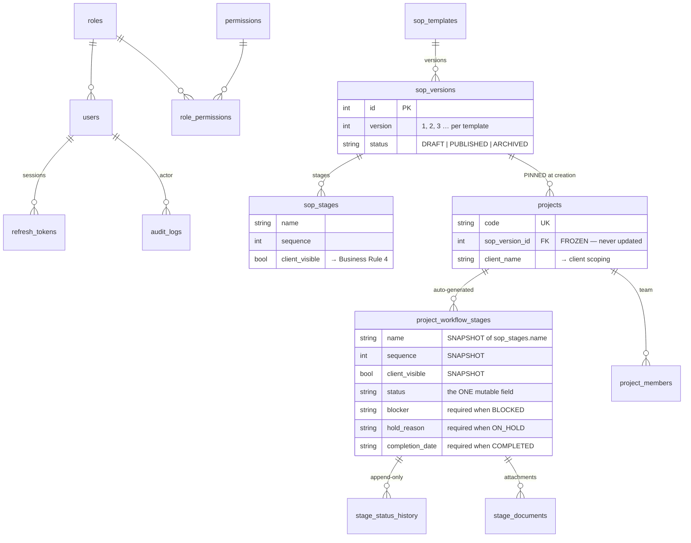

### Two decisions that carry most of the weight

**1. Editable content hangs off a *version*, never off the template.** A
template is just a stable name. This is what makes "publishing cannot affect
existing projects" structural rather than procedural.

**2. Generated stages snapshot their presentation fields.** A project stage
*copies* `name`, `sequence` and `client_visible` instead of joining back to
`sop_stages`. If it joined, renaming a stage in a draft would silently rewrite
the history of every live project. Copying makes a project's board genuinely
immutable. `sop_stage_id` is retained purely for provenance.

### Invariants enforced by the database

Four triggers make the guarantees structural rather than conventional:

| Trigger | Guarantees |
| --- | --- |
| `audit_logs_no_update` / `_no_delete` | the audit log is append-only |
| `stage_status_history_no_update` | status history cannot be rewritten |
| `sop_stages_frozen_when_published` / `_delete` / `_insert` | published SOP versions are immutable |

A test asserts this at the driver level, bypassing the API entirely:

```js
expect(() => db.prepare('UPDATE audit_logs SET summary = ? WHERE id = 1').run('x'))
  .toThrow(/append-only/);
```

---

## 6. Business rules, traced end to end

### Rule 1 — Manual status only

> *IT Members must explicitly update status. Uploading a document or adding a
> link must NOT auto-change stage status.*

Enforced **structurally**: exactly one function writes the column.

```
stageModel.applyStatusChange()      ← the ONLY UPDATE of project_workflow_stages.status
  ▲
stagesService.updateStatus()        ← the only caller
  ▲
PATCH /:stageId/status              ← requires stages:update_status
```

Everything that might plausibly move a stage is structurally incapable of it:

| Path | Why it cannot move a stage |
| --- | --- |
| `POST …/documents` | `documentModel` has one `INSERT` and no `UPDATE` against the stage table |
| `PATCH …/assign` | the zod schema has no `status` key; the model method writes only `assigned_to` and `due_date` |
| `POST /users/:id/reassign` | `stageModel.reassign()` sets `assigned_to` only |
| `PATCH /projects/:id` | the model's column allow-list excludes every stage field |

The upload response makes it observable rather than merely true:

```jsonc
// POST /api/projects/1/stages/4/documents  →  201
{ "document": { … }, "stageStatus": "NOT_STARTED", "statusUnchanged": true }
```

#### Conditional required fields

A zod discriminated union makes the request *type* depend on the target status,
so an invalid combination is rejected before any handler runs:

```js
z.discriminatedUnion('status', [
  z.object({ status: z.literal('IN_PROGRESS'), remarks: z.string().optional() }),
  z.object({ status: z.literal('BLOCKED'),   blocker:        z.string().min(3) }),  // required
  z.object({ status: z.literal('ON_HOLD'),   holdReason:     z.string().min(3) }),  // required
  z.object({ status: z.literal('COMPLETED'), completionDate: isoDate           }),  // required
]);
```

The service re-checks the same table (`STATUS_REQUIRED_FIELDS`) so the rule
survives any future caller that bypasses the route, and the React status modal
mirrors it for UX. **Three layers, one rule, server authoritative.**

Leaving a status clears the field that belonged to it, so a completed stage
never carries a stale blocker.

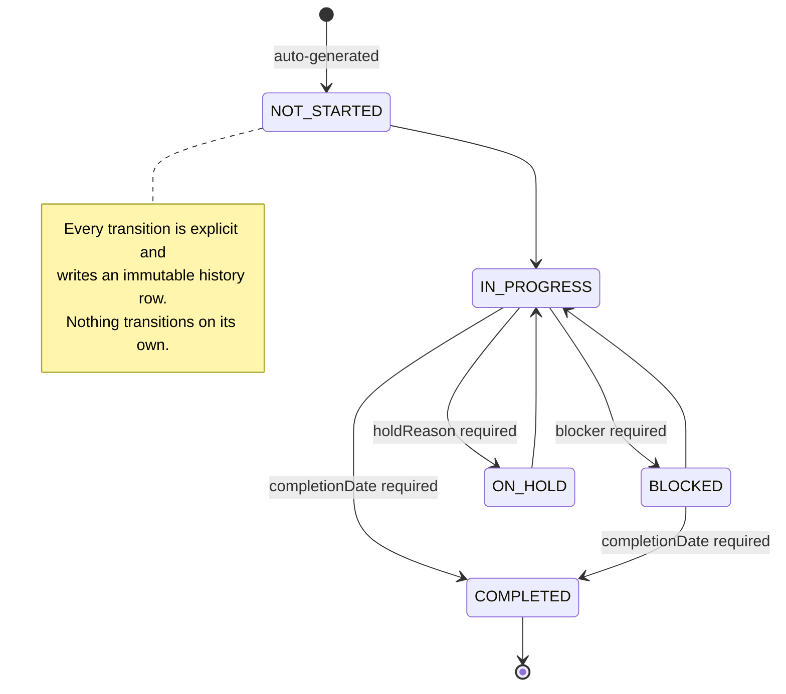

---

### Rule 4 — Server-side client filter

> *Client/Ops must not receive restricted data in API responses — not just
> hidden in the UI.*

**Three independent layers**, any one of which would suffice:

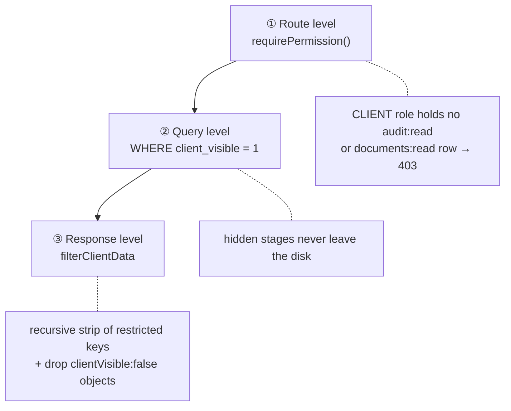

Layers ① and ② depend on a developer remembering to apply them. Layer ③ cannot
be forgotten — it is mounted once, globally, and wraps `res.json` for every
route that exists or ever will:

```js
res.json = (body) => {
  if (!req.user?.isClientScope) return originalJson(body);   // a DB column, not a name
  res.setHeader('X-Client-Filtered', 'true');
  return originalJson(stripForClient(body));                  // recursive
};
```

Hidden stages are **removed from arrays**, not blanked — so a client cannot even
infer that they exist. Stripped keys: `documents`, `auditLog`, `remarks`,
`blocker`, `holdReason`, `assignedTo`, `statusHistory`, `createdBy`,
`permissions`, and more.

Progress is recomputed over the visible subset, so a client sees `1/3` where an
admin sees `1/5` — the client's percentage never leaks the existence of hidden
work. And a client requesting a hidden stage by id gets **404, not 403**, since
"this exists but you may not see it" is itself a disclosure.

The test asserts against the serialised body, not the rendered DOM:

```js
const raw = JSON.stringify(res.body);
expect(raw).not.toContain('Internal Security Review');
expect(raw).not.toContain('"documents"');
expect(res.headers['x-client-filtered']).toBe('true');
```

---

### Rule 5 — SOP version protection

> *Publishing a new SOP must NOT affect existing projects. Each project retains
> its sopVersionId indefinitely.*

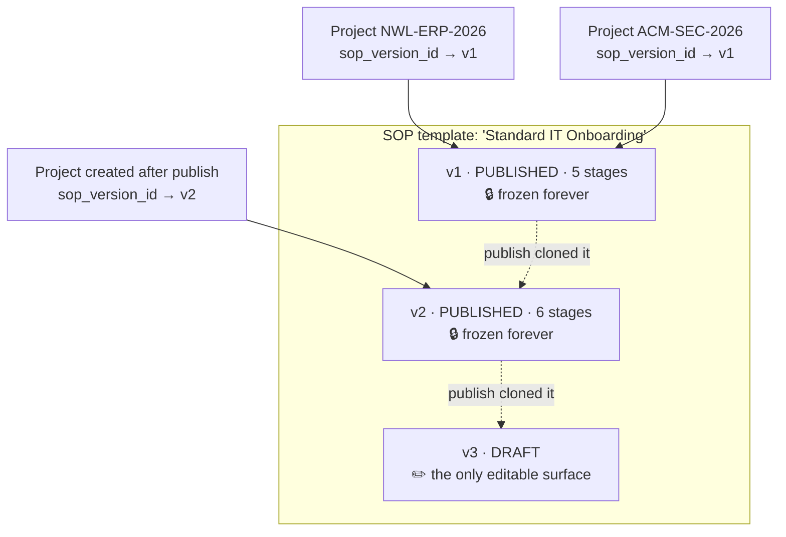

Publishing is one transaction:

1. Validate the draft has at least one stage (`422 EMPTY_SOP` otherwise).
2. `status = 'PUBLISHED'`, stamp `published_at` / `published_by`.
3. Create version *n+1* as `DRAFT` and deep-copy every stage into it.

**No statement in that transaction touches the `projects` table.** Combined with
`projectModel.update()`'s column allow-list, which omits `sop_version_id`
entirely, a project's SOP version is write-once. Schema triggers reject writes
to a published version's stages even from raw SQL.

The version-history panel shows each version's project count — v1 reading
*"2 projects"* after v2 is published is the rule, visible.

---

### Rule 7 — Auto-generate on project creation

> *Creating a project must pull the latest published SOP and auto-create
> ProjectWorkflowStage records, storing sopVersionId.*

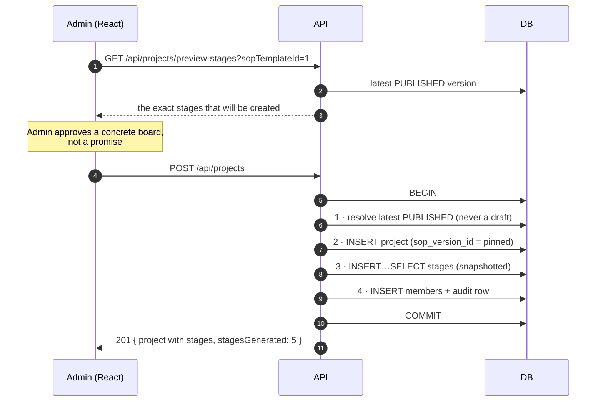

Step 3 is a single `INSERT…SELECT`, so a board cannot half-populate. If the
published version has no stages, the service throws — and because that happens
inside the transaction, the project never existed. A test asserts exactly this:
after a rejected creation, the project list is empty.

Only **published** versions are resolvable here, so an unfinished draft can
never leak into a live project. The preview endpoint and the create path use the
same resolution query, so what the Admin previews is what they get.

---

### Deactivation check

> *Check for active stage assignments before deactivating a user. Return 409 if
> found — require reassignment first.*

```mermaid
sequenceDiagram
    autonumber
    participant UI as Admin (React)
    participant API
    participant DB

    UI->>API: PATCH /api/users/3/deactivate
    API->>DB: BEGIN · active assignments for user 3?
    DB-->>API: 3 rows
    API->>DB: ROLLBACK
    API-->>UI: 409 ACTIVE_ASSIGNMENTS { assignments: [...] }
    Note over UI: usersSlice stores the details;<br/>reassign modal opens, pre-populated

    UI->>API: POST /api/users/3/reassign { toUserId: 5 }
    API->>DB: BEGIN · UPDATE assigned_to · audit · COMMIT
    API-->>UI: 200 { movedCount: 3, canDeactivateNow: true }

    UI->>API: PATCH /api/users/3/deactivate
    API->>DB: BEGIN · none found · UPDATE is_active=0 · revoke sessions · COMMIT
    API-->>UI: 200 { user }
```

"Active" means a stage in `NOT_STARTED`, `IN_PROGRESS`, `BLOCKED` or `ON_HOLD`
on a project that is `ACTIVE` or `ON_HOLD`. The check and the write share one
transaction, so a stage assigned by a concurrent request cannot slip between them.

Reassignment moves ownership and **nothing else** — every stage keeps its
current status, because Rule 1 applies here too.

Deactivation also revokes the user's refresh-token family immediately. A test
confirms their in-flight access token stops working on the very next request
(`403 ACCOUNT_DEACTIVATED`) rather than lingering for up to 15 minutes.

---

## 7. Frontend architecture

### State

```
store
├── auth      user + permissions[] · bootstrap · login/logout
├── users     list · roles · reassign { user, assignments, movedCount }
├── sop       templates · current (draft + versions) · lastPublished
├── projects  list · summary · current (board) · preview
├── stages    optimistic rollback snapshots · history · documents
├── audit     paginated entries · filters
└── ui        toasts
```

Every API call is a `createAsyncThunk` with `pending` / `fulfilled` / `rejected`
handled in its slice. Rejections carry the normalised `{ code, message, details }`
object, so components branch on a stable code, never on an HTTP status.

### `usePermission` — the only capability check

```jsx
const canPublish = usePermission('sop', 'publish');
```

It reads the `permissions[]` array the API returned at login. No component
compares a role name; the sidebar and the route table are both built from
`[module, action]` tuples. Grant `sop:publish` to Admin in the database, and
Admins see the SOP Builder link on their next login with no client change.

This is a **rendering hint**. Every action it guards is re-checked server-side,
so a hand-edited Redux store buys a visible button and a 403.

### The axios interceptor

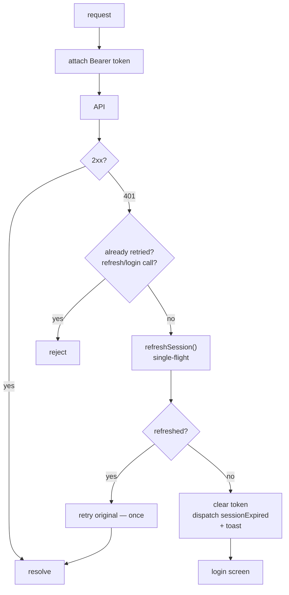

`_retried` is set on the request config, so a request is retried at most once
regardless of how many times it 401s. The single-flight promise is shared with
the startup bootstrap — see §3 for why that matters.

### Optimistic status updates

The board repaints the instant the user hits Save, then reconciles.

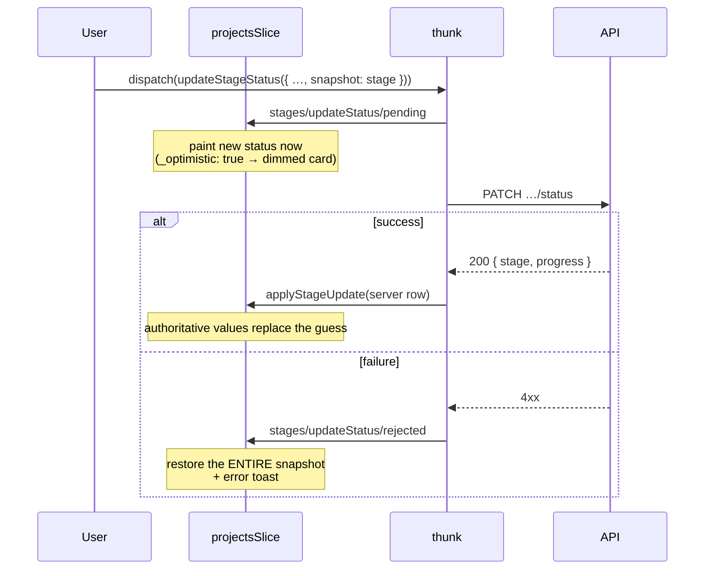

The snapshot is the whole previous stage object, not just its status: a failed
`COMPLETED` transition must also restore the old `completionDate`, `blocker` and
`remarks`, or the board would keep a phantom edit the server never accepted.

`projectsSlice` listens for `stagesSlice`'s thunk **by action-type string**
rather than importing it — `stagesSlice` already imports `applyStageUpdate` from
`projectsSlice`, so importing back would be circular, and action types are the
stable contract between slices anyway.

### `createSelector` for derived stats

`selectProgressStats` and `selectPortfolioStats` derive counts, percentages and
an `atRisk` roll-up from the stages already in the store. Memoised, so a toast
appearing or a modal opening does not redo the arithmetic.

### Screens

| Screen | Route | Guard | Notes |
| --- | --- | --- | --- |
| Login | `/login` | — | role-based redirect by capability |
| Dashboard | `/` | authenticated | portfolio stats, scoped by the API |
| Projects | `/projects` | `projects:read` | rows filtered server-side |
| Create Project | `/projects/new` | `projects:create` | live stage preview |
| Workflow Board | `/projects/:id` | `projects:read` | status modal, history, documents |
| Client View | `/projects/:id` | `projects:read` | same route, chosen by `role.isClientScope` |
| My Work | `/my-work` | `stages:update_status` | cross-project assignment list |
| SOP Builder | `/sop` | `sop:update` | draft editor, reorder, publish, history |
| User Management | `/users` | `users:read` | 409 → reassign → deactivate |
| Audit Log | `/audit` | `audit:read` | paginated, filterable, display-only |

`/projects/:id` renders the read-only Client View or the full Workflow Board
depending on `role.isClientScope` — a database column carried through the login
payload, so a new client-like role routes correctly with no change here.

---

## 8. API reference

All routes are prefixed `/api`. Every route except `/health`, `/auth/login` and
`/auth/refresh` requires a bearer token.

### Auth

| Method | Path | Permission | Notes |
| --- | --- | --- | --- |
| `POST` | `/auth/login` | — | → `{ user, accessToken }` + httpOnly cookie. `user.permissions[]` included. Rate-limited. |
| `POST` | `/auth/refresh` | cookie | Rotates. `401 REFRESH_REUSED` burns the family. |
| `POST` | `/auth/logout` | optional | Revokes + clears the cookie. |
| `GET` | `/auth/me` | authenticated | Rehydrates the store after a reload. |

### Users

| Method | Path | Permission | Notes |
| --- | --- | --- | --- |
| `GET` | `/users` | `users:read` | paginated, `?search=&roleId=&isActive=` |
| `POST` | `/users` | `users:create` | `clientName` required for client-scoped roles |
| `GET` | `/users/:id` | `users:read` | includes `activeAssignments` count |
| `PATCH` | `/users/:id` | `users:update` | a role change revokes their sessions |
| `GET` | `/users/:id/assignments` | `users:read` | read-only preview of the 409 guard |
| `PATCH` | `/users/:id/deactivate` | `users:deactivate` | **`409 ACTIVE_ASSIGNMENTS`** with the blocking list |
| `PATCH` | `/users/:id/activate` | `users:deactivate` | |
| `POST` | `/users/:id/reassign` | `users:reassign` | `{ toUserId, stageIds? }` → `{ movedCount, canDeactivateNow }` |

### Roles

| Method | Path | Permission |
| --- | --- | --- |
| `GET` | `/roles` | `roles:read` |
| `GET` | `/roles/permissions` | `roles:read` |
| `PUT` | `/roles/:id/permissions` | `roles:update` |

### SOP

| Method | Path | Permission | Notes |
| --- | --- | --- | --- |
| `GET` | `/sop` | `sop:read` | each with published/draft version summary |
| `POST` | `/sop` | `sop:create` | opens an empty draft v1 |
| `GET` | `/sop/:id` | `sop:read` | draft + published + full version history |
| `PATCH` | `/sop/:id` | `sop:update` | |
| `DELETE` | `/sop/:id` | `sop:delete` | soft delete — versions stay resolvable |
| `GET` | `/sop/versions/:id` | `sop:read` | any historical version |
| `POST` | `/sop/:id/stages` | `sop:update` | draft only |
| `PATCH` | `/sop/:id/stages/:stageId` | `sop:update` | `409 SOP_VERSION_IMMUTABLE` if published |
| `DELETE` | `/sop/:id/stages/:stageId` | `sop:update` | draft only; renumbers survivors |
| `PUT` | `/sop/:id/stages/reorder` | `sop:reorder` | `{ stageIds: [...] }` — full order |
| `POST` | `/sop/:id/publish` | `sop:publish` | freezes + opens next draft. `422 EMPTY_SOP` |

### Projects & stages

| Method | Path | Permission | Notes |
| --- | --- | --- | --- |
| `GET` | `/projects` | `projects:read` | scoped rows, paginated |
| `GET` | `/projects/summary` | `projects:read` | cards + progress |
| `GET` | `/projects/preview-stages` | `projects:create` | `?sopTemplateId=` |
| `POST` | `/projects` | `projects:create` | auto-generates the board |
| `GET` | `/projects/:id` | `projects:read` | client-filtered |
| `PATCH` | `/projects/:id` | `projects:update` | `sopVersionId` not accepted |
| `POST` | `/projects/:id/members` | `projects:assign` | |
| `DELETE` | `/projects/:id/members/:userId` | `projects:assign` | |
| `GET` | `/projects/:id/stages` | `stages:read` | hidden stages excluded for clients |
| `PATCH` | `/projects/:id/stages/:stageId/status` | `stages:update_status` | **conditional required fields** |
| `GET` | `/projects/:id/stages/:stageId/status-history` | `stages:read` | 403 for clients |
| `PATCH` | `/projects/:id/stages/:stageId/assign` | `stages:assign` | cannot change status |
| `GET` | `/projects/:id/stages/:stageId/documents` | `documents:read` | 403 for clients |
| `POST` | `/projects/:id/stages/:stageId/documents` | `documents:create` | → `statusUnchanged: true` |
| `GET` | `/me/assignments` | authenticated | the caller's open stages |

### Audit

| Method | Path | Permission | Notes |
| --- | --- | --- | --- |
| `GET` | `/audit` | `audit:read` | paginated; `?entityType=&action=&dateFrom=&dateTo=`. **403 for Client** |
| `GET` | `/audit/filters` | `audit:read` | distinct values for the dropdowns |

No write routes exist. Entries are written by services inside the transaction
that made the change.

---

## 9. Error model

Every deliberate failure is an `ApiError` with a stable code:

```jsonc
{
  "error": {
    "code": "ACTIVE_ASSIGNMENTS",
    "message": "Ivy Chen still owns 3 active stages. Reassign them before deactivating.",
    "details": { "assignmentCount": 3, "assignments": [ … ] }
  }
}
```

Anything not deliberate becomes an opaque `500 INTERNAL_ERROR`, so stack traces,
SQL and file paths never reach a browser.

| Code | Status | Meaning |
| --- | --- | --- |
| `INVALID_CREDENTIALS` | 401 | identical for wrong password and unknown email |
| `TOKEN_EXPIRED` | 401 | the interceptor's signal to refresh |
| `REFRESH_REUSED` | 401 | replay detected — whole family revoked |
| `ACCOUNT_DEACTIVATED` | 403 | checked on every request, not just login |
| `FORBIDDEN` | 403 | includes the `{ module, action }` that was required |
| `VALIDATION_ERROR` | 400 | zod issues as `[{ field, message }]` |
| `ACTIVE_ASSIGNMENTS` | 409 | **opens the reassign modal** |
| `SOP_VERSION_IMMUTABLE` | 409 | attempted edit of a published version |
| `DUPLICATE_CODE` / `DUPLICATE_EMAIL` | 409 | |
| `NO_PUBLISHED_SOP` | 422 | project creation from an unpublished template |
| `EMPTY_SOP` | 422 | publish attempted with no stages |
| `MISSING_CONDITIONAL_FIELD` | 422 | service-layer backstop for Rule 1 |

---

## 10. Phase 2 — the project working area

### The Project screen

Five tabs over one loaded project:

| Tab | Contents |
|---|---|
| **Overview** | Project fields as a labelled grid, plus derived status, completion %, progress bar and per-stage statuses |
| **Assign** | Stage owner and due date per row. The schema has no `status` key, so assignment is structurally incapable of moving a stage |
| **Workflow** | The journey. Each stage opens a drawer |
| **Team** | Project membership with role-on-project |
| **Documents** | Every document across every stage, linking back to its stage |

The drawer is the working area: **Status · Evidence · Sign-off · Bugs · History**.
The Bugs tab appears only for a `TESTING` stage. One request
(`GET /api/projects/:id/stages/:stageId`) returns everything it needs, including
the caller's stage-level permissions and a `completionBlockers` object — so the
UI can disable *Complete* **and say why**, rather than letting the user submit
and take a 409.

### Derived project status

`server/src/services/projectStatus.service.js` is a pure function of the stage
rows:

```
every stage COMPLETED   → COMPLETED
any stage BLOCKED       → AT_RISK
any stage ON_HOLD       → ON_HOLD
nothing started         → NOT_STARTED
otherwise               → IN_PROGRESS
```

An explicit administrative `CANCELLED` or `ON_HOLD` on the project outranks the
computed value; nothing else can. Because the same function takes
`clientVisibleOnly`, a client's percentage is computed over the stages they can
see — their 50% and an admin's 50% can legitimately differ, and neither leaks
the other's denominator.

### Stage-level permissions

Module-level RBAC answers "may this role touch stages at all?". Stage-level
permissions answer "may this role do *this* on *that* stage?".

```
sop_stage_permissions (sop_stage_id, role_id, action)
        │  snapshotted at project creation
        ▼
project_stage_permissions (project_stage_id, role_id, action)
```

Actions: `view`, `update_status`, `upload_evidence`, `signoff`, `raise_bug`,
`resolve_bug`, `close_bug`.

The snapshot is the point. Grants are copied onto the project's own rows inside
the creation transaction, so re-publishing the SOP with wider grants never
widens access on a project that is already running — the same reasoning that
pins `sop_version_id`.

Resolution order in `middleware/stagePermission.js`:

1. a `project_stage_permissions` row grants the caller's role that action
2. the caller is the stage assignee or the project owner → they keep the
   everyday actions, otherwise a stage could be assigned to someone unable to
   touch it
3. the caller holds `projects:read_all` → administrator, unrestricted

### The QA ↔ Development bug loop

```
        QA raises
           │
           ▼
        ┌──────┐   dev picks up   ┌─────────────┐   dev fixes   ┌───────┐
        │ OPEN │ ───────────────► │ IN_PROGRESS │ ────────────► │ FIXED │
        └──────┘                  └─────────────┘               └───┬───┘
                                        ▲                           │ QA verifies
                            QA rejects  │                           ▼
                             the fix    │                      ┌────────┐
                        ┌───────────────┴──────────────────────│ RETEST │
                        │  REOPENED (reopen_count++)           └───┬────┘
                        └──────────────────────────────────────────┤
                                                                   ▼
                                                              ┌────────┐
                                                              │ CLOSED │ terminal
                                                              └────────┘
```

`BUG_TRANSITIONS` in `config/constants.js` is the authority. An illegal jump is
rejected with the allowed set rather than silently applied, and `CLOSED` has no
successors. Which side of the loop a caller is on is decided by stage-level
permissions (`resolve_bug` vs `close_bug`), not by role name — so a QA role on
one project and a developer role on another need no code change.

Every transition writes an append-only `bug_events` row and an audit row in the
same transaction.

### The two completion gates

`assertCompletionAllowed()` runs before any write when a stage moves to
`COMPLETED`:

- **Open bugs** — a `TESTING` stage counts rows in `bugs` where the status is
  not `CLOSED`. It counts rather than trusting a cached flag, so it cannot
  drift. Refusal is `409 OPEN_BUGS_BLOCK_COMPLETION` with the blocking bugs
  listed.
- **Sign-off** — a stage flagged `requires_signoff` needs its *latest* decision
  to be `APPROVED`. Latest rather than "any approval", so a later rejection
  genuinely re-blocks. Refusal is `409 SIGNOFF_REQUIRED`.

### Public BRD tracking

The only unauthenticated data route. With no principal to filter against, the
response is built by **whitelist** — a blacklist has to be updated every time a
column is added, and this endpoint is reachable by the whole internet.

```
GET /api/public/track?brd=BRD-2026-0042
  → { project: { brdNumber, name, clientName, status, startDate,
                 targetEndDate, owner },
      progress: { total, completed, percentComplete },
      stages: [ { name, description, sequence, status,
                  dueDate, startedAt, completionDate } ] }
```

Hidden stages are excluded in SQL, so they are never loaded. Rate-limited per
IP, every lookup audited with actor `PUBLIC`, and an unknown BRD returns the
same 404 as a malformed one so the endpoint cannot enumerate valid numbers.

A BRD number is a bearer secret — anyone holding it sees that project. That is
what "no login" means, and it is the brief's tradeoff. A production system
handling sensitive engagements would want a second factor.

### Role preview

`GET /api/roles/:id/preview` returns another role's effective permissions,
resulting navigation and capability summary — as **data**. It grants nothing:
the caller's token is unchanged and every subsequent request is still
authorised against their real role. Anything else would be a privilege-
escalation endpoint with a friendly name.

### Notifications, search, reports, settings

- **Notifications** are generated in-process on assignment, bug events and
  sign-off decisions. Every query is scoped to `req.user.id`, so there is no
  permission to check and no way to read another tray. Per-user preferences can
  silence a category. Delivery never throws: a failed notification must not roll
  back the business change that triggered it.
- **Search** gates each result bucket by the permission that governs it and runs
  project rows through the same scope filter as the project list, so it can
  never surface something the caller could not open.
- **Reports** aggregate only over projects in scope.
- **Settings** are per-user (theme, density, notification preferences) plus a
  permission-gated system table. Theme is applied to `<html data-theme>` before
  first paint, so a dark-mode user never sees a light flash.

## 11. What I would do next

Honest scope notes — deliberate omissions, not oversights.

**Documents are metadata only.** `stage_documents` stores a filename and a URL;
there is no binary upload. Adding multipart handling and object storage is a
contained change behind the existing endpoint, and it would not touch Rule 1,
which is about what upload *does not* do.

**Stage dependencies.** The schema has `sequence` but no `depends_on`. Blocking
stage *n* until *n−1* completes would be a self-referencing FK plus one check in
`updateStatus` — the single write path makes this a small change.

**Notifications.** No scaffold. The natural seam is the audit append: every
state change already funnels through one helper, so an outbound queue would hang
off it without touching any service.

**Phase 2 integration stubs.** No OpenProject or Timesheet service stubs. The
module boundary is where they would sit.

**Permission caching.** Permissions are read per request — one indexed join,
correct and fast at this scale. At high traffic I would add a per-role in-memory
cache invalidated by `PUT /api/roles/:id/permissions`, rather than moving
permissions into the JWT, which would reintroduce the staleness window.

**SQLite → PostgreSQL.** Chosen so `npm install && npm run dev` needs no
external service. The schema is portable and all SQL is confined to
`server/src/models/`; the migration is the driver plus those ten files.
